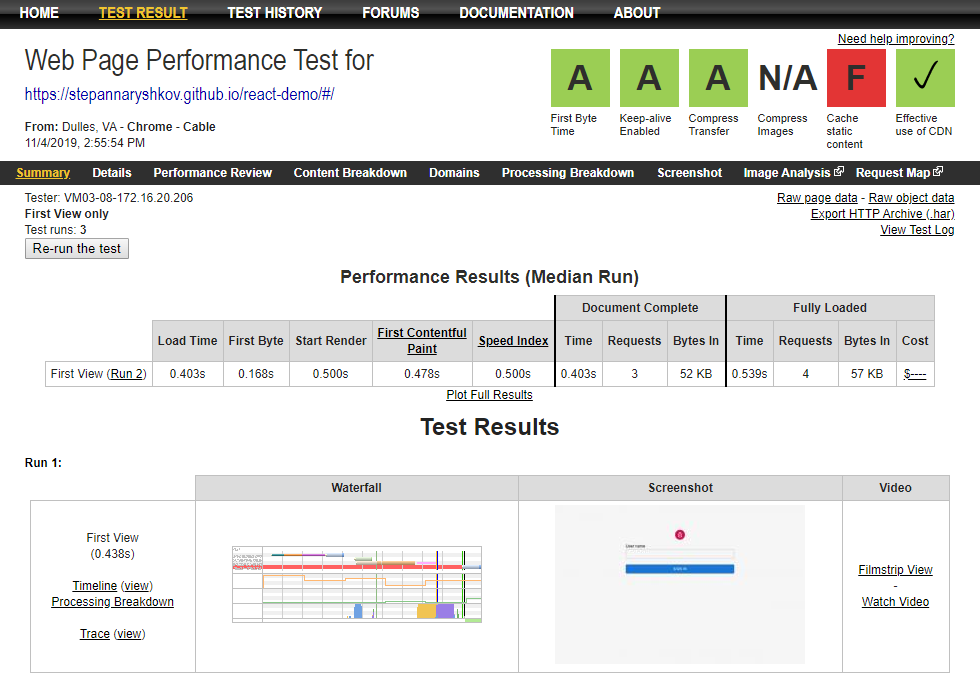
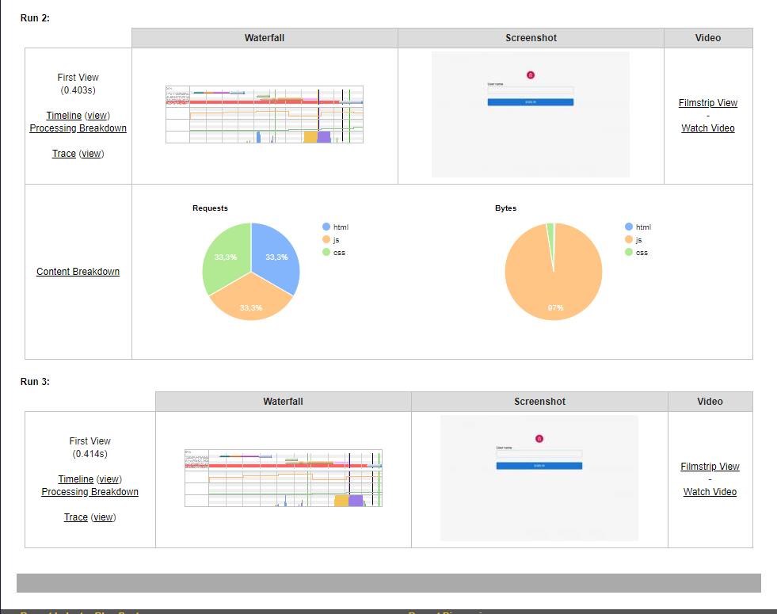

# react app

*Note that you will need to have [Node.js](https://nodejs.org) installed.*

## Performance result
Network:


Performance results:



## Get started

Install the dependencies...

```bash
npm install
```

...then start [webpack](https://webpack.js.org/):

```bash
npm run start
```

Navigate to [localhost:3000](http://localhost:3000). You should see your app running. Edit a component file in `src`, save it, and reload the page to see your changes.
