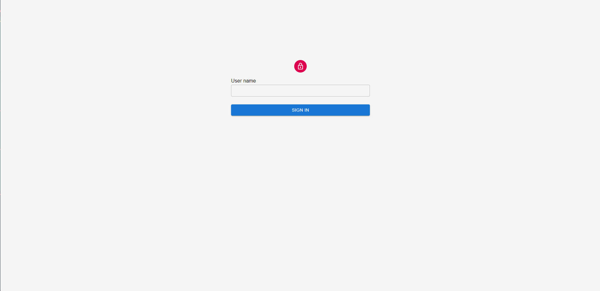

# svelte app

*Note that you will need to have [Node.js](https://nodejs.org) installed.*

##Demo
[](https://drive.google.com/file/d/1ZMs54N_0Q5FxgjuUGCd8uRVIhd9Xao20/view?usp=sharing)
## Get started

Install the dependencies...

```bash
cd svelte-app
npm install
```

...then start [Rollup](https://rollupjs.org):

```bash
npm run dev
```

Navigate to [localhost:5000](http://localhost:5000). You should see your app running. Edit a component file in `src`, save it, and reload the page to see your changes.
